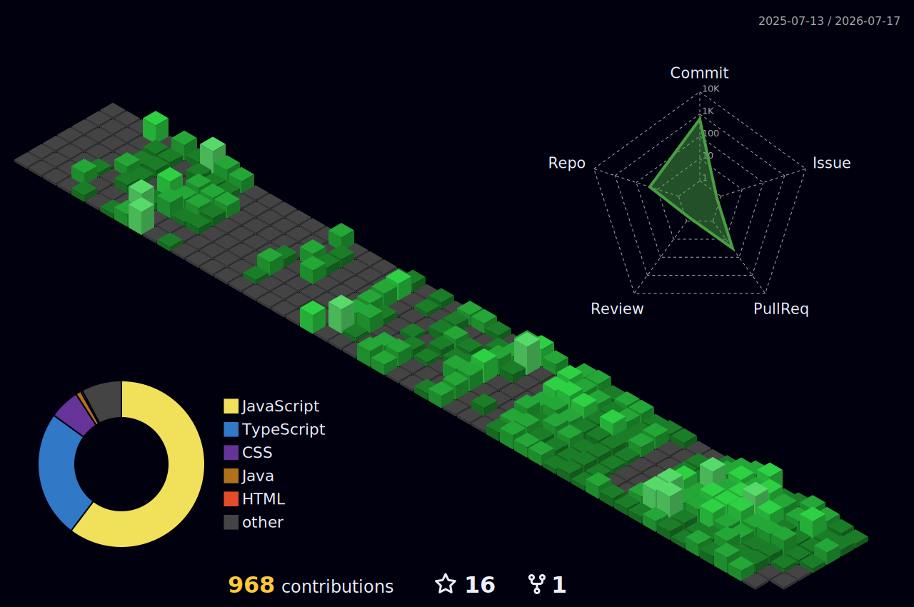

  

---

<table align="center">
  <tr>
    <td>
      
    </td>
    <td width="400">
      <ul>
        <li>I'm <b>Pranjal Sahu</b></li>
        <li>Currently learning <b>Web Development</b></li>
        <li>Building projects to improve skills</li>
        <li>Exploring backend technologies</li>
        <li>Learning <b>System Design & Scaling Techniques</b></li>
        <li>Pronouns: He/Him</li>
      </ul>
    </td>
  </tr>
</table>

---

## • Skills & Tools

&nbsp;&nbsp;&nbsp;

&nbsp;&nbsp;&nbsp;

&nbsp;&nbsp;&nbsp;

&nbsp;&nbsp;&nbsp;

&nbsp;&nbsp;&nbsp;

&nbsp;&nbsp;&nbsp;

&nbsp;&nbsp;&nbsp;

&nbsp;&nbsp;&nbsp;

&nbsp;&nbsp;&nbsp;

&nbsp;&nbsp;&nbsp;

&nbsp;&nbsp;&nbsp;

&nbsp;&nbsp;&nbsp;

&nbsp;&nbsp;&nbsp;

&nbsp;&nbsp;&nbsp;

&nbsp;&nbsp;&nbsp;

&nbsp;&nbsp;&nbsp;

---

## • GitHub Stats

  

  

  <picture>
    <source media="(prefers-color-scheme: dark)" srcset="https://raw.githubusercontent.com/Pranjal-Sahu21/Pranjal-Sahu21/output/github-contribution-grid-snake-dark.svg"/>
    <source media="(prefers-color-scheme: light)" srcset="https://raw.githubusercontent.com/Pranjal-Sahu21/Pranjal-Sahu21/output/github-contribution-grid-snake.svg"/>
    
  </picture>

---

## • Connect with me

  
  &nbsp;&nbsp;
  

